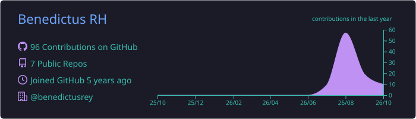
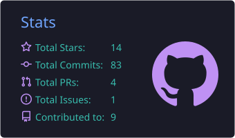
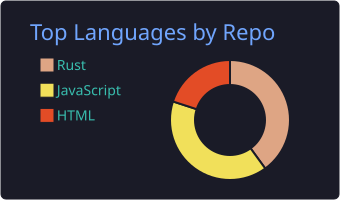
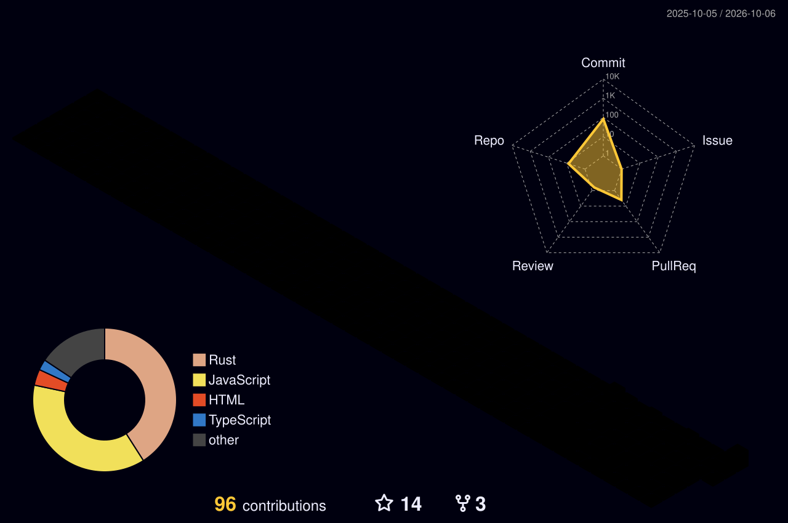

  

I'm **Benedictus RH**, a PhD student in Nagoya, Japan, studying wood biodegradation with **hyperspectral imaging, X-ray CT, and Python**. I build **Rust/Tauri desktop applications** and practical **AI tools**.

### Selected projects

| Project | What it does | Explore |
| :--- | :--- | :--- |
| **WhatsNow** | WhatsApp desktop app with multiple accounts, App Lock, and focus tools. | [Code](https://github.com/benedictusrey/WhatsNow-for-WhatsApp) ·  |
| **TubeNow** | YouTube desktop app with local Shields, persistent sessions, and tray controls. | [Code](https://github.com/benedictusrey/TubeNow) ·  |
| **IG Now** | Instagram desktop app built with Rust and Tauri. | [Code](https://github.com/benedictusrey/IG-Now) ·  |
| **Codex Monitor** | Windows dashboard for Codex usage, reset deadlines, and model runway. | [Code](https://github.com/benedictusrey/Codex-Monitor) ·  |

More desktop projects: [X Now](https://github.com/benedictusrey/X-Now) · [TikTok Now](https://github.com/benedictusrey/TikTok-Now)

### GitHub progress

  

  
  

### A year of contributions, in 3D

  

Stats and calendar refresh daily. They reflect GitHub activity; each tool uses its own counting window.

  
Tools & automatic updates

[Summary Cards](https://github.com/vn7n24fzkq/github-profile-summary-cards) · [3D Contrib](https://github.com/yoshi389111/github-profile-3d-contrib) · [Capsule Render](https://github.com/kyechan99/capsule-render) · [Shields.io](https://github.com/badges/shields)

Cards and calendar are stored in this repository and regenerated by the [daily workflow](.github/workflows/profile-stats.yml). Release badges update through Shields.io. Language cards exclude this profile and the opencodex fork; public code may not include my research.

Generator versions are pinned. [Dependabot](.github/dependabot.yml) checks weekly for action updates and proposes pull requests for review.

