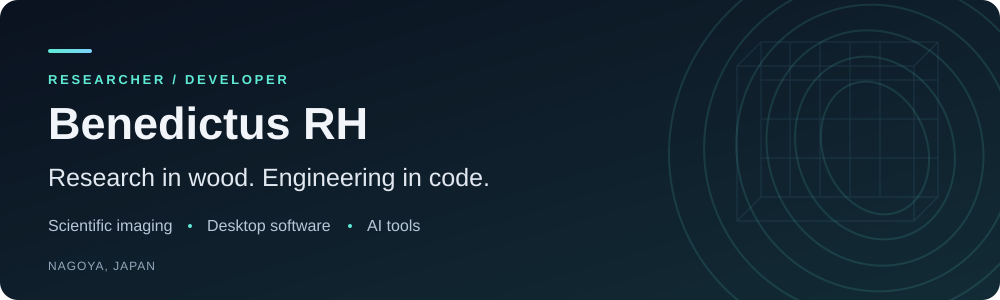
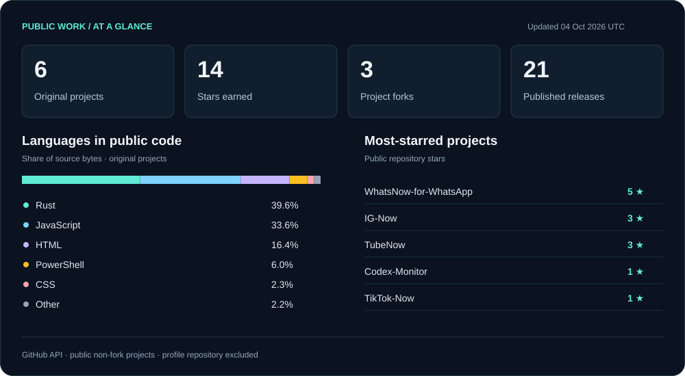

  

  <a href="#research--engineering">Research &amp; engineering</a> &nbsp; · &nbsp;
  <a href="#selected-projects">Selected projects</a> &nbsp; · &nbsp;
  <a href="#public-github-stats">GitHub stats</a>

I'm **Benedictus RH**, a PhD student in Nagoya, Japan, exploring wood biodegradation through **hyperspectral imaging, X-ray CT, and Python**. I also build desktop applications and tools for working with AI.

My work connects two interests: understanding complex materials through imaging, and making everyday software more useful.

### Research & engineering

| Scientific imaging | Software engineering |
| :--- | :--- |
| Wood biodegradation and material structure | Desktop applications with Rust and Tauri |
| Hyperspectral imaging and X-ray CT | Focus, session management, and native controls |
| Python for data analysis and research workflows | AI tools, usage monitoring, and provider exploration |

### Selected projects

| Project | What it does | Explore |
| :--- | :--- | :--- |
| **WhatsNow** | WhatsApp desktop client with multiple accounts, App Lock, themes, and focus tools. | [Code](https://github.com/benedictusrey/WhatsNow-for-WhatsApp) · [Releases](https://github.com/benedictusrey/WhatsNow-for-WhatsApp/releases) |
| **TubeNow** | A desktop home for YouTube with local Shields, persistent sessions, and tray controls. | [Code](https://github.com/benedictusrey/TubeNow) · [Releases](https://github.com/benedictusrey/TubeNow/releases) |
| **IG Now** | An Instagram desktop client built with Tauri and Rust. | [Code](https://github.com/benedictusrey/IG-Now) · [Releases](https://github.com/benedictusrey/IG-Now/releases) |
| **Codex Monitor** | A Windows dashboard for Codex usage, reset deadlines, timezones, and model runway. | [Code](https://github.com/benedictusrey/Codex-Monitor) · [Releases](https://github.com/benedictusrey/Codex-Monitor/releases) |

More desktop projects: [X Now](https://github.com/benedictusrey/X-Now) · [TikTok Now](https://github.com/benedictusrey/TikTok-Now)

### Public GitHub stats

Updated daily from the GitHub API. Counts cover public, non-fork projects and exclude this profile repository. Language shares measure GitHub-reported source bytes, not proficiency. Research described above may not be represented in public repositories. [Data & refresh workflow](.github/workflows/profile-stats.yml).

---

  <strong>Scientific imaging · Thoughtful desktop software · Practical AI tools</strong> 
  <a href="https://github.com/benedictusrey?tab=repositories">Browse my repositories</a> &nbsp; · &nbsp;
  <a href="https://github.com/benedictusrey?tab=stars">Explore my stars</a>

