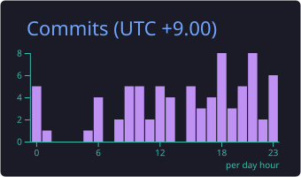
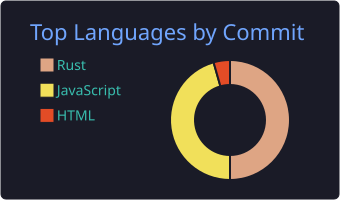

  

  <a href="#research--engineering">Research &amp; engineering</a> &nbsp; · &nbsp;
  <a href="#selected-projects">Selected projects</a> &nbsp; · &nbsp;
  <a href="#github-progress">GitHub progress</a>

I'm **Benedictus RH**, a PhD student in Nagoya, Japan, exploring wood biodegradation through **hyperspectral imaging, X-ray CT, and Python**. I also build desktop applications and tools for working with AI.

My work connects two interests: understanding complex materials through imaging, and making everyday software more useful.

### Research & engineering

| Scientific imaging | Software engineering |
| :--- | :--- |
| Wood biodegradation and material structure | Desktop applications with Rust and Tauri |
| Hyperspectral imaging and X-ray CT | Focus, session management, and native controls |
| Python for data analysis and research workflows | AI tools, usage monitoring, and provider exploration |

### Selected projects

| Project | What it does | Explore |
| :--- | :--- | :--- |
| **WhatsNow** | WhatsApp desktop client with multiple accounts, App Lock, themes, and focus tools. | [Code](https://github.com/benedictusrey/WhatsNow-for-WhatsApp) ·  |
| **TubeNow** | A desktop home for YouTube with local Shields, persistent sessions, and tray controls. | [Code](https://github.com/benedictusrey/TubeNow) ·  |
| **IG Now** | An Instagram desktop client built with Tauri and Rust. | [Code](https://github.com/benedictusrey/IG-Now) ·  |
| **Codex Monitor** | A Windows dashboard for Codex usage, reset deadlines, timezones, and model runway. | [Code](https://github.com/benedictusrey/Codex-Monitor) ·  |

More desktop projects: [X Now](https://github.com/benedictusrey/X-Now) · [TikTok Now](https://github.com/benedictusrey/TikTok-Now)

### GitHub progress

  

  
  

  
  

Cards refresh daily using GitHub Profile Summary Cards. The time chart uses UTC+9. Language cards exclude this profile repository and the opencodex fork; they describe GitHub activity, not proficiency. Scientific research may not be represented in public repositories.

### A year of contributions, in 3D

  

Built from the contribution data GitHub exposes to the workflow. Each tool uses its own counting window, so totals may differ slightly. Contribution counts follow GitHub's attribution rules and do not measure total work or research output.

  
Open-source tools behind this profile

- [GitHub Profile Summary Cards](https://github.com/vn7n24fzkq/github-profile-summary-cards) — profile history, statistics, language charts, and activity by hour.
- [GitHub Profile 3D Contrib](https://github.com/yoshi389111/github-profile-3d-contrib) — the 3D contribution calendar.
- [Shields.io](https://github.com/badges/shields) — live release badges for the selected projects.
- [Capsule Render](https://github.com/kyechan99/capsule-render) — the gradient banner.

The cards and calendar are generated by [this daily workflow](.github/workflows/profile-stats.yml) and stored in this repository. Both generator actions are pinned to verified upstream commits. Authentication uses the built-in GitHub Actions token.

---

  <strong>Scientific imaging · Thoughtful desktop software · Practical AI tools</strong> 
  <a href="https://github.com/benedictusrey?tab=repositories">Browse my repositories</a> &nbsp; · &nbsp;
  <a href="https://github.com/benedictusrey?tab=stars">Explore my stars</a>

